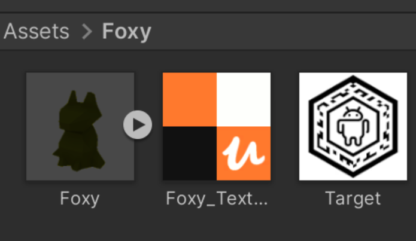
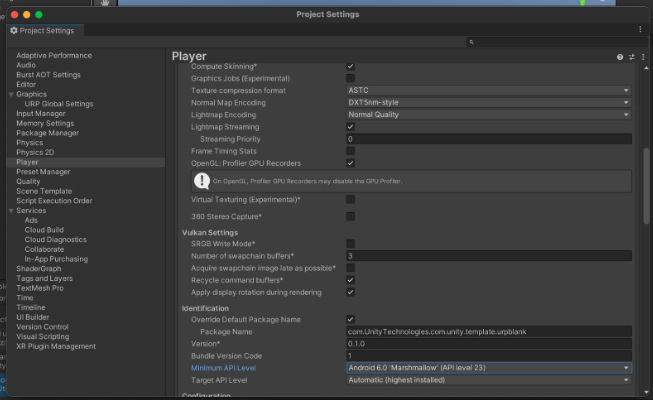

Este documento va a mostrar cómo crear una experiencia básica de AR con “Foxy”.

    1. Crear proyecto de Unity

En Unity Hub darle a `crear nuevo proyecto` y seleccionar `3D (URP)` que significa Universal Render Pipeline

    2. Primeros pasos del proyecto

**i.** Seleccionar el menu de `Build Settings` y `Switch platform` a Android

**ii.** Click a `Build`  

Esto va a generar un ejecutable, se espera que este paso tome tiempo.

    3. Agregar assets al proyecto

**i.** Crear una carpeta (con click derecho) para tener los archivos bien ordenados

**ii.** Descargar los archivos y arrastrarlos a la carpeta recién creada

[Modelo 3D Foxy](https://www.dropbox.com/s/g0m6o7za4fgbu73/Foxy%20-%20Unity.rar?dl=0)

[Segunda opción para modelo Foxy](https://sketchfab.com/3d-models/foxy-unity-84606a8519f64896ac34ed8539060d71)

**Target image:**

**iii.** Crear nueva escena (dentro de la misma carpeta)

    4. Instalar Vuforia en el proyecto

Seleccionar la opción de `Add Vuforia Engine to a Unity Project or upgrade to the latest version`

[Descargar Vuforia](https://developer.vuforia.com/downloads/sdk)

**i.** Abrir Unity y darle click al paquete que se acaba de descargar y darle a `import`’` y darle a actualizar.

**ii. Checar instalación**  
Para asegurarse de que se instaló adecuadamente darle a Window -> Package Manager y Vuforia debería de aparecer en la lista

**iii. Crear licencia en Vuforia**  
[Sitio de Vuforia](https://developer.vuforia.com/vui/develop/licenses)

a. Seleccionar `Get Basic`

b. Darle un nombre

c. Seleccionar la licencia y copiar la `license key`

    5.Agregar elementos de Vuforia al proyecto

**i.** Abrir la escena que se creo anteriormente (darle doble click)

**ii.** En la lista de elementos de la escena agregar una vuforia camera

**iii.** Eliminar la main camera

**iv** Seleccionar la ARCamera y darle click a `Open Vuforia Engine configuration`

**v.** Pegar la licencia que anteriormente se copió

**vi.** Agregar un ImageTarget

**vii.** Configurar el image target

- Seleccionar el image target y en Advance modificar la escala de width y height a 1.
- En la parte de image arrastrar la imagen de target que se descargó previamente.

**viii.** Arrastrar el modelo 3D como hijo del image target

    6. Probar la experiencia

Darle click al botón de play de arriba.

## Posibles Errores

- Es posible que salga este mensaje de error al darle `Build` al proyecto.  
  

File → Build Settings → Android platform -> Player Settings -> Player -> Other Settings -> Cambiar el Minimum API LEVEL de 22 a 23.

