# Interfaz de Usuario

| Orientación de            |                                  pantalla                                   |
| ------------------------- | :-------------------------------------------------------------------------: |
| Portrait                  |                                  Landscape                                  |
| Se puede usar solo 1 mano | Se necesitan dos manos pero hay más espacio para la experiencia en pantalla |

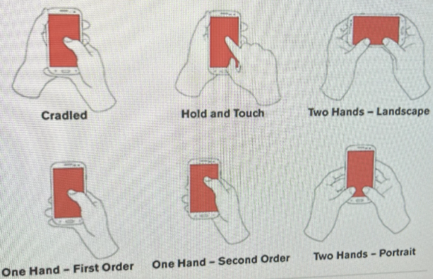

Una buena interfaz es una que no se tiene que explicar porque es intuitiva. Es importante cuidar que no haya contaminación visual, tener solo lo más importante visible de forma directa.

El estándar de la pantalla es 16:9 Portrait.
Es más fácil editar la UI cuando la perspectiva del editor está en 2D.
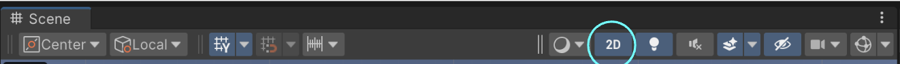

## Elementos de UI

Para agregar los elementos hay que posicionarse sobre la ventana de hierarchy (donde están los objetos de la escena) y darle click derecho -> UI

> Aparecen enlistados los elementos para una interfaz gráfica. El principal elemento es el Canvas, todo lo de la GIU necesita estar dentro de un canvas (ser su hijo).

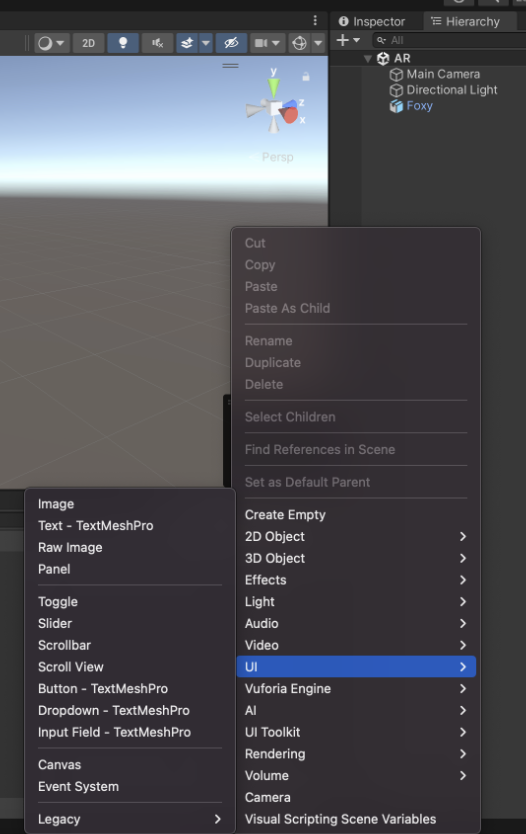

Se puede distinguir un objeto de UI de otros objetos con el tipo de transform (los de tipo UI son Rect Transform):

| Objeto común                                               |                     Objeto UI                      |
| ---------------------------------------------------------- | :------------------------------------------------: |
| 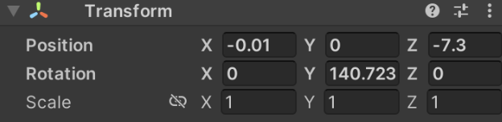 | 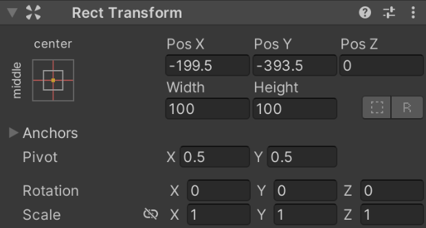 |

### Canvas

En el inspector del Canvas:

- Render Mode:
  - Screen Space - Overlay es para poder trabajar la UI sin que "estorben" los elementos de la experiencia
  - Screen Space - Camera para poder colocar la UI sobre una cámara en específico
    - Ej. Si una cámara simula una cámara de seguridad probablemente querríamos
  - Screen Space - World Space más utilizado en VR para colocar la UI dentro del mundo
- Sort Order es para cuando hay múltiples Canvas y se le quiere dar prioridad de visibilidad a alguno.

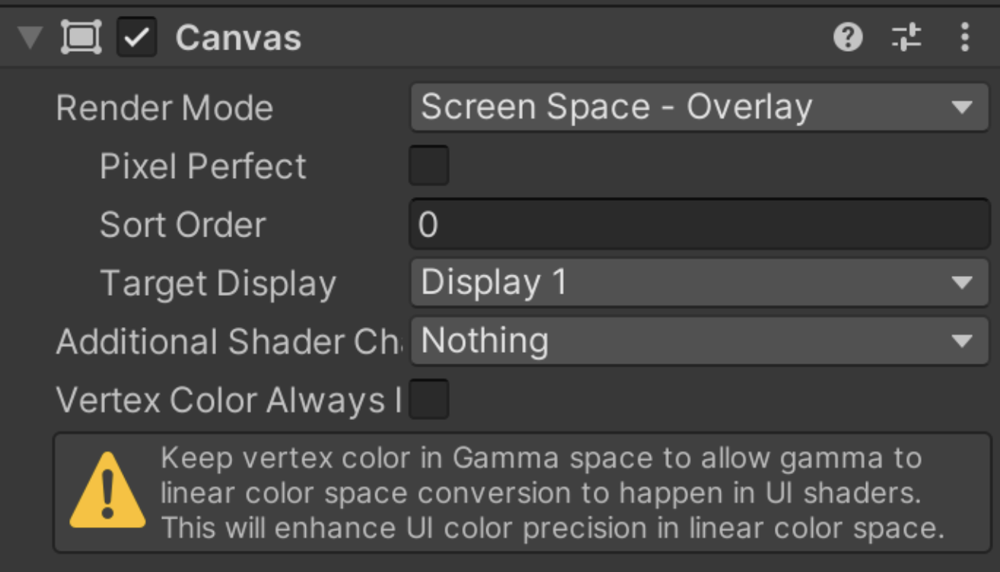

- UI Scale Mode:

  - Scale With Screen Size - Toma como referencia una resolución en específico y si cambia la del dispositivo, cambia la de la interfaz de forma responsiva.
    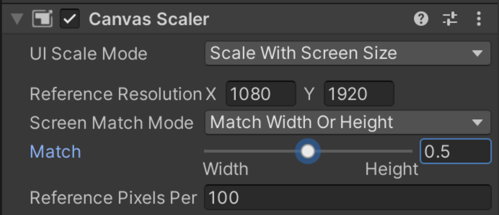

- InspectorRaycaster:
  - Permite interactuar con textos/botones
    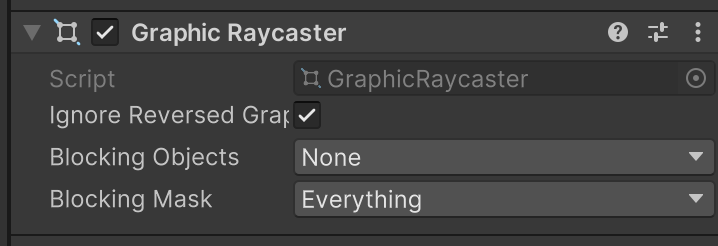

El event sistema (que se crea cuando añadimos un Canvas) nos permite generar eventos del canvas.

### Anchor Points (Rect Transform)

Los puntos de anclaje de una imagen son a donde va a tender una imagen cuando cambia el tamaño de la pantalla. Nos ayuda a hacer la IU responsiva.

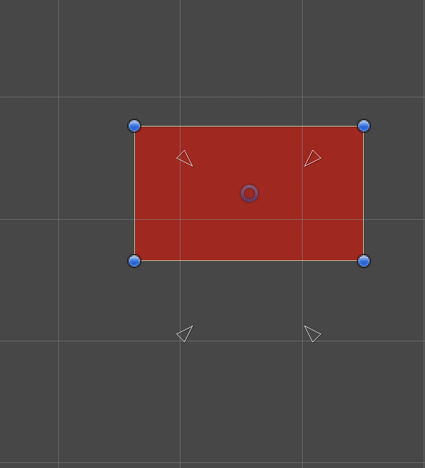

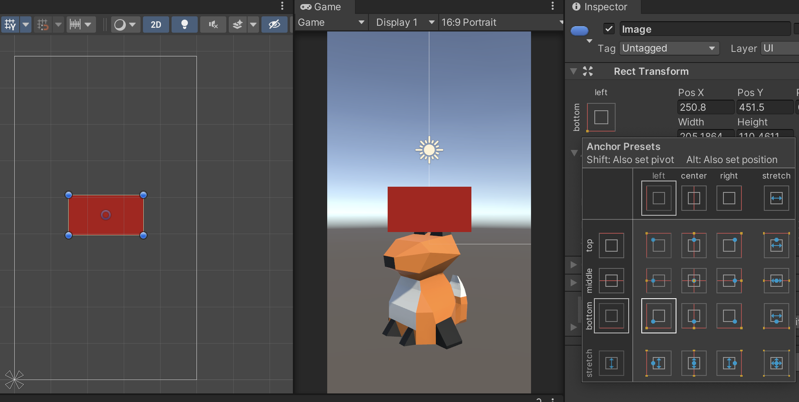

Cuando se está en la ventana de `anchors` y se le da click a `shift` entonces también cambia el pivote

- El `pivot` es el punto entorno el cual va a girar la figura.

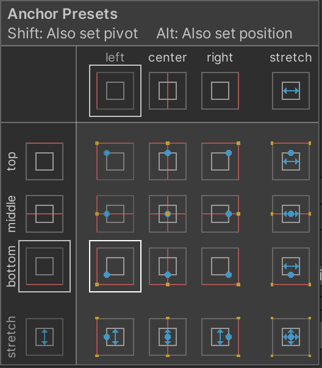

Cuando se está en la ventana de `anchors` y se le da click a `alt` entonces también cambia la posición del objeto

Para checar si los puntos de anclaje se establecieron correctamente sirve cambiar las dimensiones del dispositivo (Portrait-Landscape)

### Texto

#### Legacy Texto

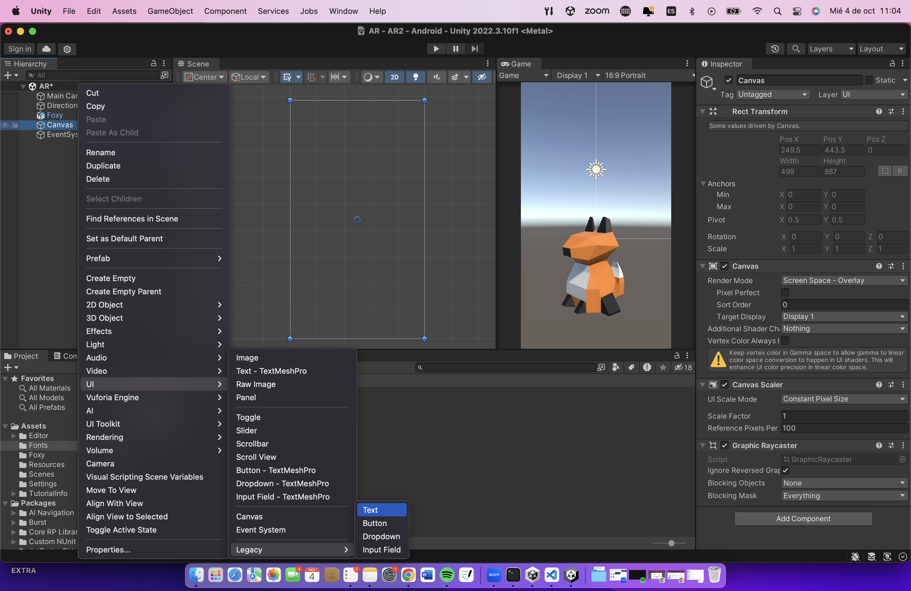

Para cambiar el font:
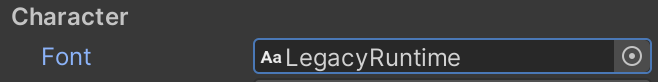

Pero primero hay que importar el font que queramos usar. Se necesita agregar al proyecto el archivo `.ttf` o `.ttc` del font que quieras.

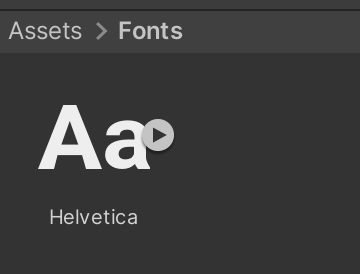

Usando HTML se pueden modificar las características del texto. (Tiene que estar seleccionada la opción de `Rich Text`)

Si `Raycast Target` está activado se le está informando que el texto puede recibir interacción, si no se espera que sea interactivo hay que desmarcar la opción para no sobrecargar inecesariamente el programa.

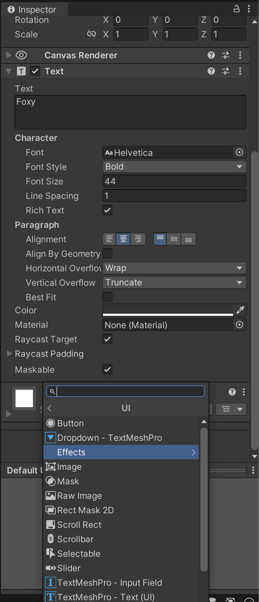

Es una buena práctica agregarle outline a nuestros textos
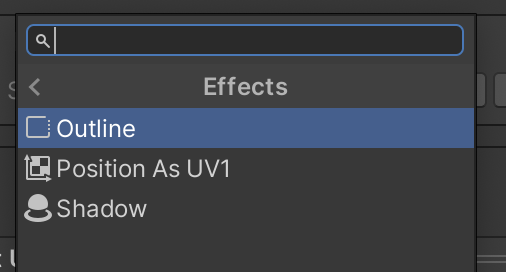

Si aumentamos su escala (no su `size` directamente, el texto se va a pixelear)

#### Text Mesh Pro

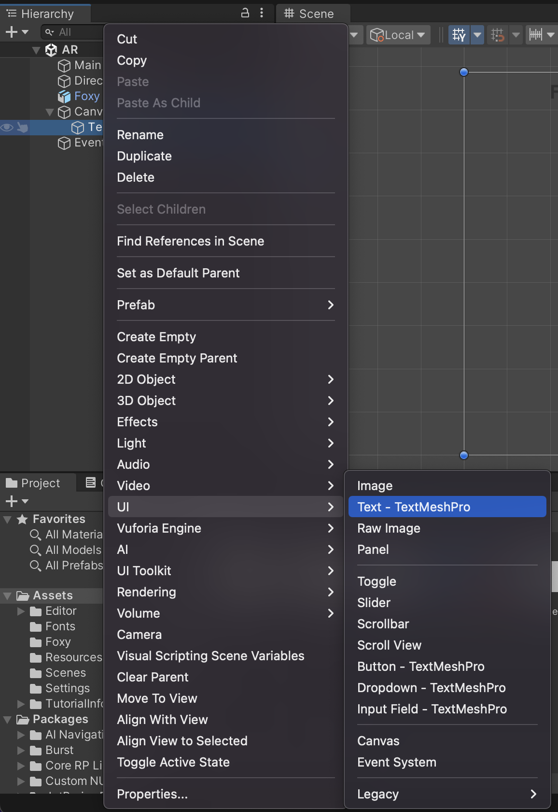

Si no aparece la opción de importar los essentials entonces
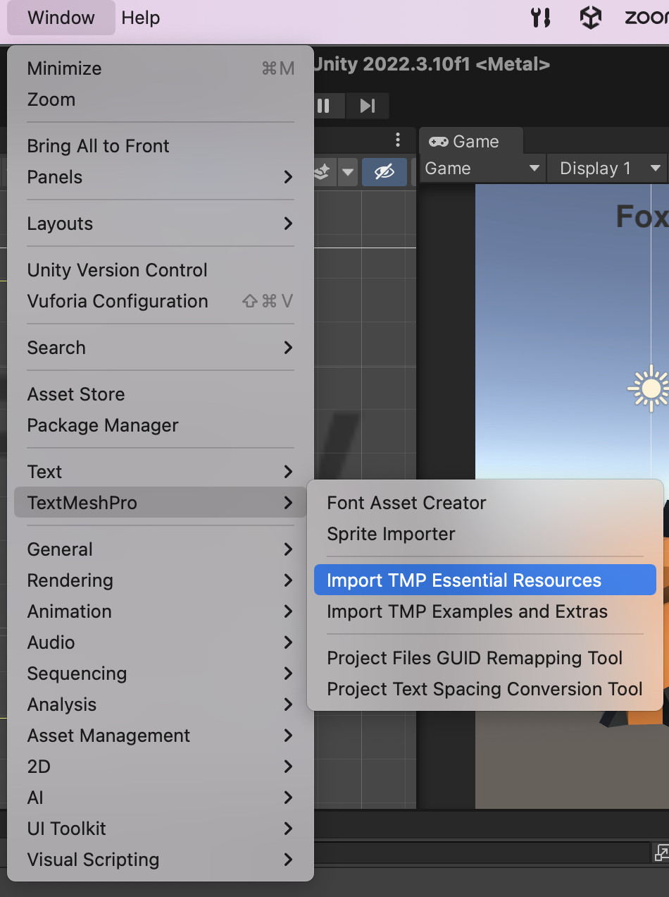

Con esta opción de texto tenemos más posibilidades y no se pixelea como lo hace el Legacy-Text

Si se quiere usar un font diferente al default se tiene que crear el asset porque el Text Mesh Pro no trabaja con archivos .ttf

### Imagenes

Cuando importas una imagen a Unity lo hace como textura. Si la queremos como tal en la GUI necesitamos cambiarla a `Sprite`.
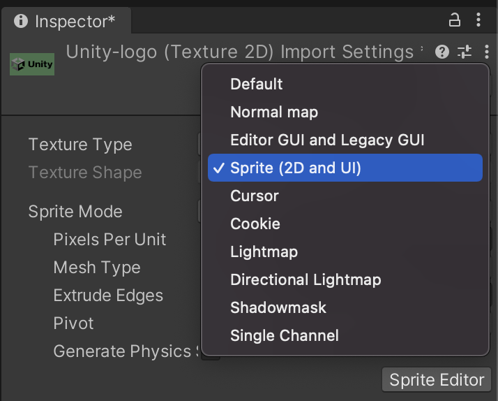

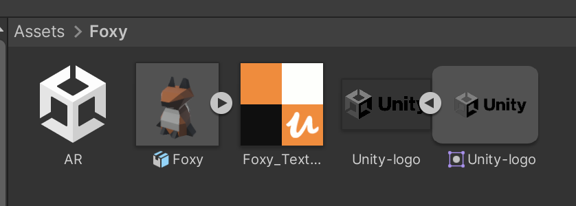

Se agrega el componente UI de imagen y se agrega el sprite como `source image`
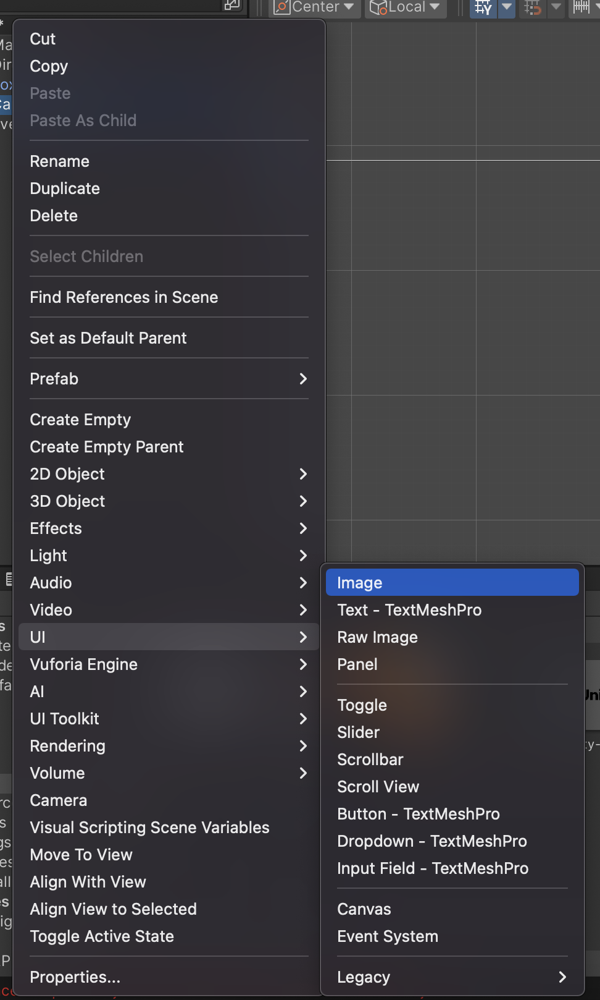

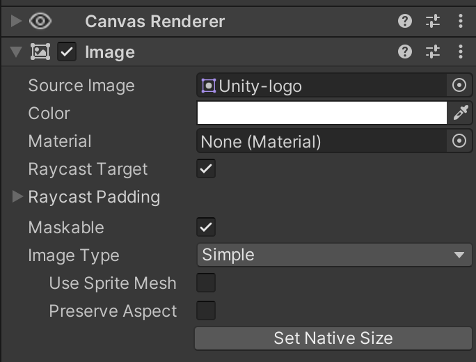

Si se usa el objeto de `Raw Image` no se tiene que convertir la textura a sprite, se puede usar directamente como se importó.

Tiene una propiedad `UV Rect` que se puede usar para animar la imagen.

Típicamente el objeto de `image` se suele usar en lugar de `raw image` cuando se trata de la GUI.

También hay un componente que se le puede agregar a las imagenes que es el de `mask` (máscara).

### Botones

Al igual que con el texto, en las últimas versiones de Unity está `Legacy Button` y `Button-Text Mesh Pro`.

En la ventana de inspector del botón:

- Interactable: Determina si se puede interactuar con el botón o no
- Transition: Se puede cambiar la forma en la que se ve el botón cuando interactuamos con él
  - Target Graphic: Se puede agregar también una imagen al canvas y que unirla al botón para que cambie cuando se le de click al botón.
- Navigation: Se puede alterar a qué otro elemento de la interfaz se mueve cuando se seleccionan ciertas teclas / botones. Utiles para juegos de consola.
- Evento On Click: al darle click al `+` se le puede asociar una función/objeto para que se trigere cuando se le de click al botón.
  - Se crea un objeto vacío (mismo proceso que si se estuviera creando un botón)
  - Le arrastramos un script en específico a ese nuevo objeto
  - Se arrastra ese objeto con script dentro del espacion On Click del botón
  - Se selecciona qué función del objeto se ejecutará con el click (necesita ser pública y puede ser una función de a lo mucho 1 parámetro)
  - Se le pueden asociar múltiples objetos-funciones al botón

Los componentes de toggle y slider funcionan de forma muy similar.

Dentro del canvas le podemos agregar a uno de los objetos (ej. `content` del `viewport`) el componente extra de `Layout` para acomodar/centrar los elementos de una forma más eficiente.
